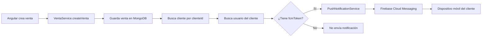

# 📋 Instrucciones Finales: Configuración de Notificaciones Push

## ✅ Cambios Realizados en Spring Boot

### 1. Dependencias Añadidas
- ✅ `firebase-admin` (v9.2.0) en `pom.xml`

### 2. Modelo Actualizado
- ✅ Campo `fcmToken` añadido a `Usuario.java`
  - Tipo: `String` (nullable)
  - No afecta registros existentes

### 3. Archivos Nuevos Creados

#### `FirebaseConfig.java`
- Inicializa Firebase Admin SDK
- Busca `firebase-service-account.json` en `resources/`
- Muestra advertencias si el archivo no existe

#### `PushNotificationService.java`
- Envía notificaciones push a dispositivos móviles
- Métodos:
  - `enviarNotificacionVentaCreada()`
  - `enviarNotificacionVentaConfirmada()`
  - `enviarNotificacionVentaEditada()`
  - `enviarNotificacionVentaCancelada()`
  - `enviarNotificacionPrueba()`

#### `FcmTokenController.java`
- Endpoints REST para gestión de tokens FCM:
  - `POST /api/fcm/token` - Actualizar token
  - `DELETE /api/fcm/token` - Eliminar token
  - `POST /api/fcm/test` - Enviar notificación de prueba

### 4. Servicios Modificados

#### `VentaService.java`
- Métodos añadidos para enviar notificaciones automáticamente:
  - Al crear venta desde Angular → Notificación al cliente
  - Al confirmar venta → Notificación al cliente
  - Al editar venta → Notificación al cliente
  - Al cancelar venta → Notificación al cliente

---

## 🔧 Pasos Pendientes para el Desarrollador

### Paso 1: Obtener Credenciales de Firebase

1. Ve a [Firebase Console](https://console.firebase.google.com/)
2. Crea un proyecto (si no existe): `agencia-viajes-movil`
3. Ve a **⚙️ Configuración del proyecto** → **Cuentas de servicio**
4. Click en **"Generar nueva clave privada"**
5. Se descarga un archivo JSON (ejemplo: `agencia-viajes-movil-firebase-adminsdk-xxxxx.json`)

### Paso 2: Configurar Spring Boot

1. **Renombra** el archivo descargado a: `firebase-service-account.json`
2. **Colócalo** en: `src/main/resources/firebase-service-account.json`
   ```
   agencia-backend/
   └── src/
       └── main/
           └── resources/
               ├── application.properties
               └── firebase-service-account.json  ← AQUÍ
   ```

### Paso 3: Ignorar en Git

Añade a `.gitignore`:
```gitignore
# Firebase credentials
src/main/resources/firebase-service-account.json
```

### Paso 4: Recompilar y Reiniciar

```bash
# Windows
mvnw clean install
mvnw spring-boot:run

# Linux/Mac
./mvnw clean install
./mvnw spring-boot:run
```

### Paso 5: Verificar Logs

Al iniciar, deberías ver:
```
✅ Firebase Admin SDK inicializado correctamente
🔔 Sistema de notificaciones push activo
```

Si no tienes el archivo JSON, verás:
```
⚠️ Archivo firebase-service-account.json no encontrado
📝 Para habilitar FCM:
   1. Descarga firebase-service-account.json desde Firebase Console
   2. Colócalo en src/main/resources/
   3. Reinicia la aplicación
```

---

## 🧪 Pruebas

### Prueba 1: Verificar que Spring Boot reconoce Firebase

**Logs esperados al iniciar:**
```
✅ Firebase Admin SDK inicializado correctamente
🔔 Sistema de notificaciones push activo
```

### Prueba 2: Registrar token FCM desde Postman

```http
POST http://localhost:8080/api/fcm/token
Content-Type: application/json
Authorization: Bearer {TOKEN_JWT_DEL_CLIENTE}

{
  "fcmToken": "TOKEN_FCM_DE_PRUEBA_AQUI"
}
```

**Respuesta esperada:**
```json
{
  "success": true,
  "message": "Token FCM actualizado correctamente",
  "data": {
    "email": "cliente@ejemplo.com",
    "tokenLength": "152"
  }
}
```

### Prueba 3: Enviar notificación de prueba

```http
POST http://localhost:8080/api/fcm/test
Authorization: Bearer {TOKEN_JWT_DEL_CLIENTE}
```

**Respuesta esperada:**
```json
{
  "success": true,
  "message": "Notificación de prueba enviada correctamente",
  "data": "Revisa tu dispositivo móvil"
}
```

### Prueba 4: Crear venta desde GraphQL (Angular)

Al crear una venta desde Angular, los logs de Spring Boot deberían mostrar:
```
🔔 Notificación enviada al cliente: cliente@ejemplo.com
✅ Notificación de venta creada enviada: projects/.../messages/...
```

---

## 📊 Flujo Completo



---

## 🔍 Troubleshooting

### ❌ Error: "FileNotFoundException: firebase-service-account.json"

**Solución:**
1. Verifica que el archivo esté en `src/main/resources/`
2. El nombre debe ser exactamente: `firebase-service-account.json`
3. Reinicia Spring Boot

### ❌ Logs: "Firebase no está inicializado"

**Causa:** El archivo JSON no está presente o tiene errores.

**Solución:**
1. Descarga nuevamente el archivo desde Firebase Console
2. Verifica que sea un JSON válido
3. Colócalo en `resources/` y reinicia

### ❌ Notificaciones no llegan al dispositivo

**Verificar:**
1. El token FCM del cliente está guardado en MongoDB
2. Firebase está correctamente inicializado en Spring Boot
3. El token FCM no ha caducado (Flutter debe renovarlo)
4. El dispositivo tiene conexión a internet

**Revisar logs:**
```
✅ Token FCM actualizado para: cliente@ejemplo.com
🔔 Notificación enviada al cliente: cliente@ejemplo.com
✅ Notificación de venta creada enviada: projects/...
```

---

## 📝 Endpoints de la API

### 1. Actualizar Token FCM
```http
POST /api/fcm/token
Authorization: Bearer {token}
Content-Type: application/json

{
  "fcmToken": "string"
}
```

### 2. Eliminar Token FCM
```http
DELETE /api/fcm/token
Authorization: Bearer {token}
```

### 3. Enviar Notificación de Prueba
```http
POST /api/fcm/test
Authorization: Bearer {token}
```

---

## 🔒 Seguridad

### ¿Qué datos se envían en las notificaciones?

**Datos públicos (seguros):**
- ✅ ID de la venta
- ✅ Nombre del paquete turístico
- ✅ Monto total
- ✅ Tipo de evento (creada, confirmada, editada, cancelada)

**Datos NO incluidos (privados):**
- ❌ Datos de pago
- ❌ Información personal sensible
- ❌ Detalles completos de la reserva

**Los detalles completos** se cargan desde la API cuando el usuario abre la notificación.

---

## 📚 Estructura de Notificaciones

### Notificación de Venta Creada
```json
{
  "notification": {
    "title": "🎉 Nueva Reserva Registrada",
    "body": "Tu reserva para Caribe Paradisíaco ha sido registrada exitosamente"
  },
  "data": {
    "type": "VENTA_CREADA",
    "ventaId": "6913350a8c1596983beea290",
    "nombrePaquete": "Caribe Paradisíaco",
    "monto": "1850.0",
    "timestamp": "1731338000000"
  }
}
```

### Notificación de Venta Confirmada
```json
{
  "notification": {
    "title": "✅ Reserva Confirmada",
    "body": "Tu reserva para Caribe Paradisíaco ha sido confirmada"
  },
  "data": {
    "type": "VENTA_CONFIRMADA",
    "ventaId": "6913350a8c1596983beea290",
    "nombrePaquete": "Caribe Paradisíaco",
    "monto": "1850.0",
    "timestamp": "1731338000000"
  }
}
```

---

## ✅ Checklist de Verificación

- [ ] Dependencia `firebase-admin` añadida en `pom.xml`
- [ ] Campo `fcmToken` en modelo `Usuario`
- [ ] Archivo `firebase-service-account.json` en `resources/`
- [ ] Firebase Console: Proyecto creado
- [ ] Spring Boot inicia sin errores
- [ ] Logs muestran: "✅ Firebase Admin SDK inicializado"
- [ ] Endpoint `/api/fcm/token` funciona
- [ ] Endpoint `/api/fcm/test` funciona
- [ ] Crear venta desde Angular envía notificación

---

## 📞 Soporte

Si encuentras problemas:

1. **Revisa los logs** de Spring Boot
2. **Verifica** que `firebase-service-account.json` exista
3. **Prueba** el endpoint `/api/fcm/test` con Postman
4. **Confirma** que el token FCM del cliente esté guardado en MongoDB

---

**Fecha de implementación:** 11 de Noviembre, 2025  
**Versión:** 1.0.0  
**Compatible con:** Android 10+ (API 29+)

---

## 🎯 Próximos Pasos

Una vez que Spring Boot esté configurado:

1. Pasa la guía `GUIA_NOTIFICACIONES_PUSH_FLUTTER.md` al equipo de Flutter
2. Flutter configurará Firebase en la app móvil
3. Flutter enviará el token FCM al backend
4. ¡Las notificaciones funcionarán automáticamente!

